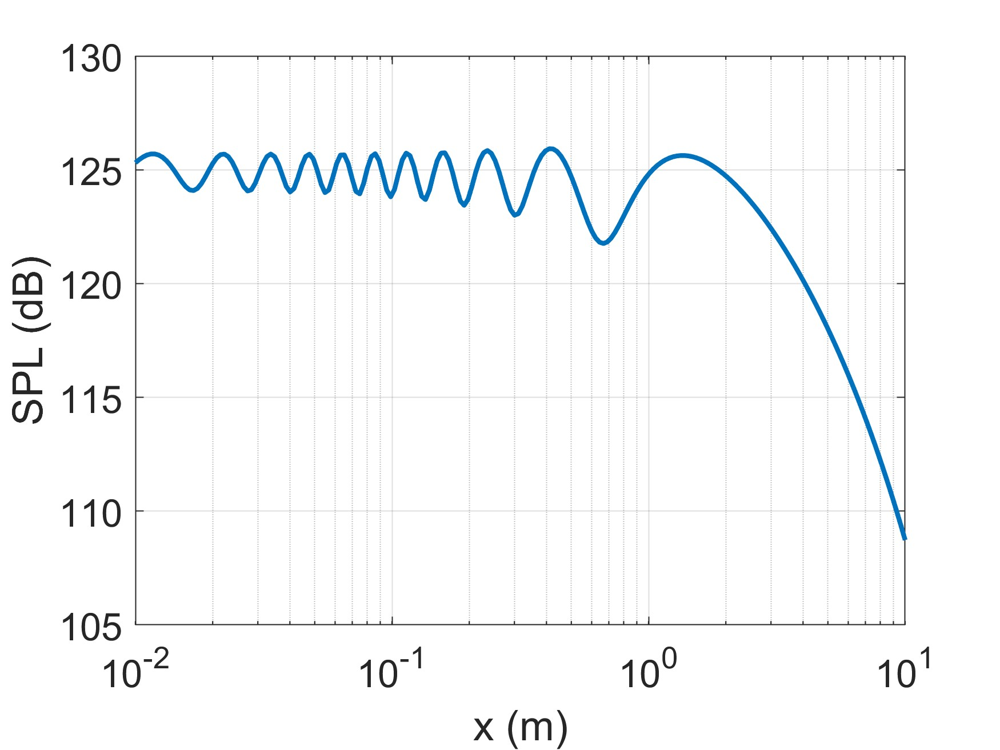
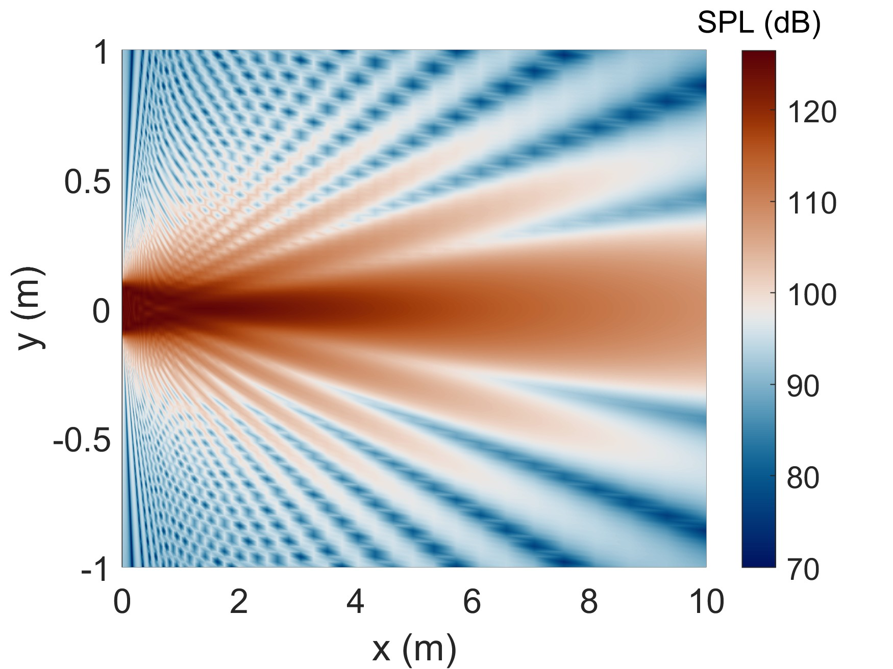

Direction Integration Method (DIM)
========================================

Demos related to the DIM.

Ultrasound field
---------------------

Demo: `LineSrc_DIM_Demo1.m`
^^^^^^^^^^^^^^^^^^^^^^^^^^^^^^^^^^^^^^^^^^^^^^
Calculate the axial sound field at :math:`x = 0` m.

Example 1
"""""""""""""""""""""""""""""
See :numref:`fig_LineSrc_DIM_Demo1`, where the source settings are as follows.

..  code-block:: matlab

	wav = SoundWave('freq', 40e3);
	prf = SrcProfile('name', 'uniform');
	src = LineSrc('radius', .1, 'prf', prf, 'wav', wav);

.. _fig_LineSrc_DIM_Demo1:

   Axial ultrasound field at 40 kHz generated by a line source with a radius of 10 cm.
   The source profile is uniform (piston source).
   The on-surface pressure amplitude  :math:`p_0 = 50\, \mathrm{Pa}\ (125\,\mathrm{dB})`.

Demo: `LineSrc_DIM_Demo2.m`
^^^^^^^^^^^^^^^^^^^^^^^^^^^^^^^^^^^^^^^^^^^^^^
Calculate the 2D sound field.

Example 1
"""""""""""""""""""""""""""""
See :numref:`fig_LineSrc_DIM_Demo2`, where the source settings are as follows.

..  code-block:: matlab

	wav = SoundWave('freq', 40e3);
	prf = SrcProfile('name', 'uniform');
	src = LineSrc('radius', .1, 'prf', prf, 'wav', wav);

.. _fig_LineSrc_DIM_Demo2:

   2D ultrasound field at 40 kHz generated by a line source with a radius of 10 cm.
   The source profile is uniform (piston source).
   The on-surface pressure amplitude  :math:`p_0 = 50\, \mathrm{Pa}\ (125\,\mathrm{dB})`.
