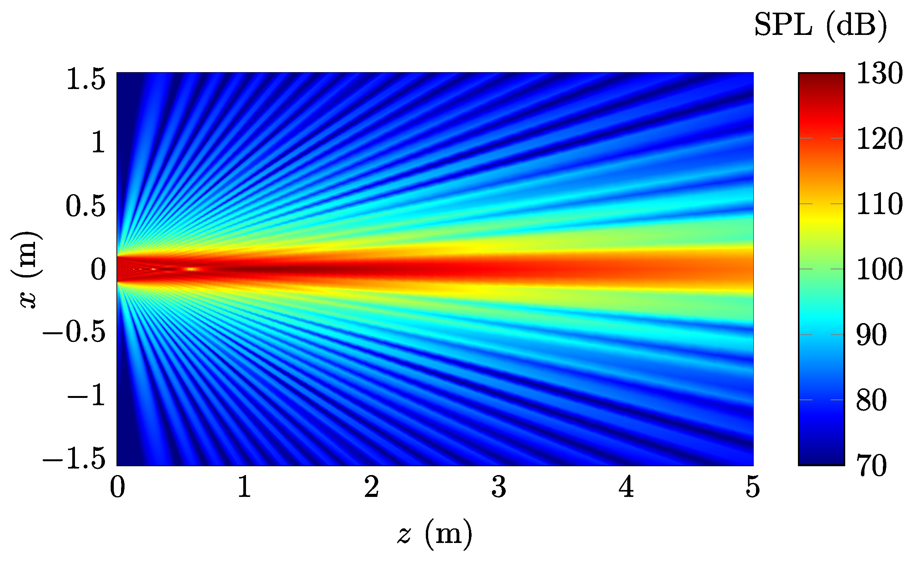

Ultrasound Field
=======================

Demo 1: `CircSrc_SWE_Demo1.m`
------------------------------------------
Plot the 2D linear ultrasound field.

Examples
^^^^^^^^^^^^^^^^

See :numref:`fig_CircSrc_SWE_Demo1_2D`, where the source settings are as follows.

..  code-block:: matlab

    prf = SrcProfile('name', 'uniform');
    src = CircSrc('radius', .1, 'prf', prf, 'freq', 40e3);

.. _fig_CircSrc_SWE_Demo1_2D:

   Ultrasound field at 40 kHz generated by a circular source with a radius of 10 cm.
   The source profile is uniform (piston source). 
   The on-surface pressure amplitude  :math:`p_0 = 50\, \mathrm{Pa}\ (125\,\mathrm{dB})`.

Demo 2: `CircSrc_SWE_Demo2.m`
----------------------------------------
Calculate the directivity using the SWE.
